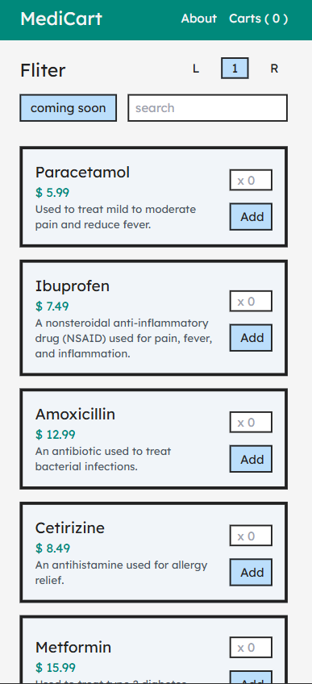

# MediCart

MediCart is a web-based cart system designed for an online medicine-selling platform.
Built using React, it provides a seamless responsive design,
intuitive interface, and core functionalities like product listing, cart management, and checkout simulation.



## Features:

- Product Listing: Browse a variety of medicines with detailed information.
- Search and Filter: Find medicines quickly using search bar and filter options.
- Add to Cart: Add items to the cart with ease.
- Cart Management:
- View all selected items.
- Update quantities or remove items from the cart.
- View total price dynamically.
- Responsive Design: Optimized for desktop and mobile users.

## Technologies Used:

- Frontend: React (with hooks and context API)
- Styling: CSS or TailwindCSS
- State Management: React Context API

## Installation Instructions

1. **Clone the Repository**

   ```bash
   git clone https://github.com/HtetAungLw1n/medi-cart.git
   ```

   cd medicart

2. **Install Dependencies**

- Ensure Node.js and npm are installed, then run:
- npm install

3. **Run the Development Server**

- npm start
- Open your browser and navigate to http://localhost:3000.

## Contributing:

Contributions are welcome! Please fork the repository and create a pull request
with detailed information about your changes.

## Contact Information:

If you have any questions or suggestions, feel free to reach out:

Email: htetaunglwin.canon@gmail.com

GitHub: https://github.com/HtetAungLw1n
